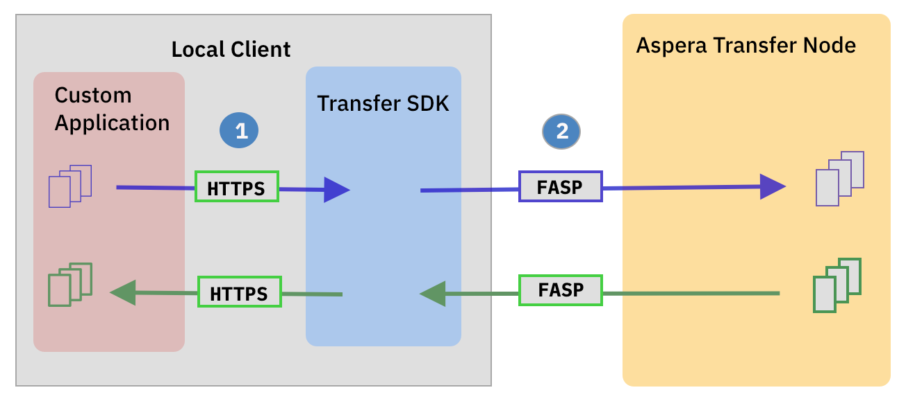

# IBM Cloud Object Storage Examples

- [aspera-download.py](aspera-download.py) - Example of downloading a file from the specified object storage bucket using Aspera FASP technology.
- [aspera-upload.py](aspera-upload.py) - Example of uploading a file from the specified object storage bucket using Aspera FASP technology.
- [cos-download.py](cos-download.py) - Example of downloading a file from the specified object storage bucket using the S3 protocol.
- [cos-upload.py](cos-uplaod.py) - Example of uploading a file from the specified object storage bucket using the S3 protocol.

## Aspera FASP protocol

THe Aspera FASP protocol requires the Aspera Transfer SDK which is included in this repo.   Details of the [SDK](https://developer.ibm.com/apis/catalog/aspera--aspera-transfer-sdk/Introduction) can be
found on the IBM Developer site.   The Transfer SDK daemon makes the gRPC service available to the sample aspera-download and aspera-upload python scripts.


### Using the sample python scripts to transfer files using Aspera
For large file transfers in high latency situations using Aspera FASP can reduce upload and download transfer times for cloud significantly.

1. configure the [ibmcloud.ini](ibmcloud.ini.example) with the Object Storage Instance CRN, Desired Endpoint, and associated Aspera Transfer Node.
```azure
[ibmcloud]
cos_endpoint=https://s3.eu-de.cloud-object-storage.appdomain.cloud
aspera_transfer_node=https://ats-sl-fra.aspera.io:443
cos_instance_crn=<cos instance CRN>
```
Additional information on using the Aspera SDK with IBM Cloud Object Storage and specific instructions for determining the best aspera_transfer_node can be found at https://cloud.ibm.com/docs/cloud-object-storage?topic=cloud-object-storage-aspera.

2. Prior to running either the upload or download script first start the aspers daemon.
```azure
./aspera-sdk/bin/asperatransferd
```
3. export the cos_apikey or specify as a command line option.
```azure
export cos_apikey=mykey
```
4. run aspera-upload or aspera-download scripts.
```azure
./aspera-download.py -h
usage: aspera-download.py [-h] [--inifile INIFILE] [--apikey COS_APIKEY] [--bucket COS_BUCKET] [--file FILE]

Download a file from COS bucket using Aspera.

optional arguments:
  -h, --help            show this help message and exit
  --inifile INIFILE, -i INIFILE
                        inifile which contains the required parameters
  --apikey COS_APIKEY, -k COS_APIKEY
                        COS apikey
  --bucket COS_BUCKET, -b COS_BUCKET
                        Bucket to download from.
  --file FILE, -f FILE  file to download from COS

./aspera-download --bucket my_bucket --file myfile.tar

```

## S3 Protocol
1. configure the [ibmcloud.ini](ibmcloud.ini.example) with the Object Storage Instance CRN, Desired Endpoint, and associated Aspera Transfer Node.
```azure
[ibmcloud]
cos_endpoint=https://s3.eu-de.cloud-object-storage.appdomain.cloud
cos_instance_crn=<cos instance CRN>
```
Additional information can be found on using Python and the ``ibm_boto3`` library at https://cloud.ibm.com/docs/cloud-object-storage?topic=cloud-object-storage-python

2. export the cos_apikey or specify as a command line option.
```azure
export cos_apikey=mykey
```
3. run cos-upload or cos-download scripts.
```azure
./cos-upload.py -h
usage: cos-upload.py [-h] [--inifile INIFILE] [--apikey COS_APIKEY] [--bucket COS_BUCKET] [--file FILE]

Upload a file to COS bucket.

optional arguments:
  -h, --help            show this help message and exit
  --inifile INIFILE, -i INIFILE
                        inifile which contains the required parameters
  --apikey COS_APIKEY, -k COS_APIKEY
                        COS apikey
  --bucket COS_BUCKET, -b COS_BUCKET
                        Bucket to upload to.
  --file FILE, -f FILE  file to upload to COS


./cos-download --bucket my_bucket --file myfile.tar

```
